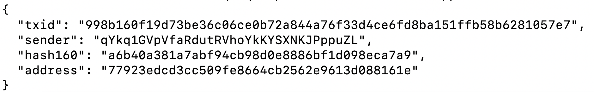
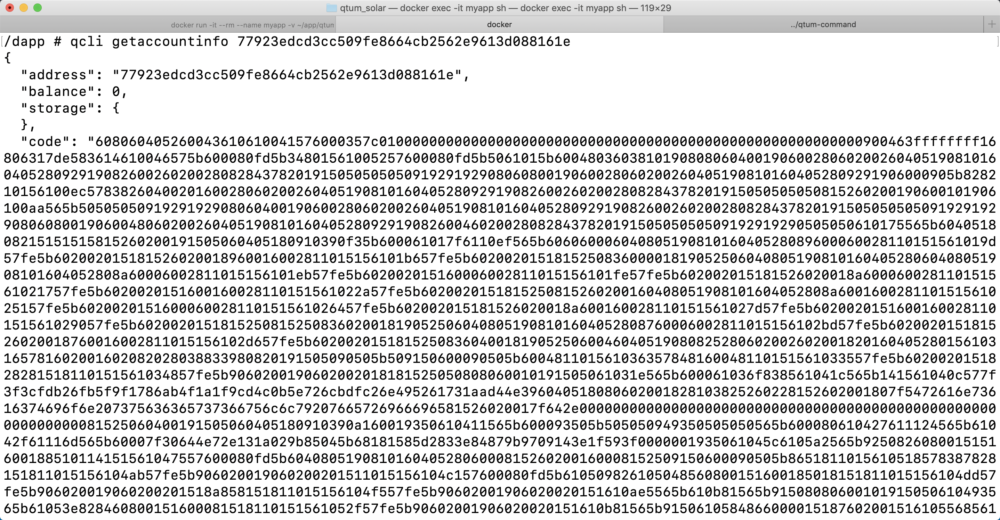
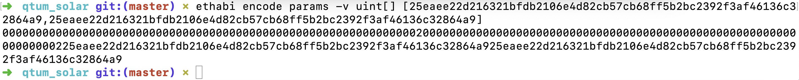

# Zokrates_Demo
A demo using Zokrates to build an encrypted transaction on Ethereum/Qtum based on zkSNARKs algorithm.

> This is a proof-of-concept implementation. It has not been tested for production.

## Zokrates Introduction

[ZoKrates](https://github.com/Zokrates/ZoKrates) is a toolbox for zkSNARKs on Ethereum. It helps you use verifiable computation in your DApp, from the specification of your program in a high level language to generating proofs of computation to verifying those proofs in Solidity.

Using Zokrates, we can implement the zkSNARKs in the platform which supports Solidity.

The goal of zero-knowledge proofs is for a *verifier* to be able to convince herself that a *prover* possesses knowledge of a secret parameter, called a *witness*, satisfying some relation, without revealing the witness to the verifier or anyone else.

In order to let platform like Ethereum/Qutm support zkSNARKs, we use Zokrates to generate the proof.

## Zokrates Installation

Zokrates official manual can be found in [Here](https://zokrates.github.io/gettingstarted.html).

### One-line install
We provide a one-line install for Linux, MacOS and FreeBSD:

```bash
curl -LSfs get.zokrat.es | sh
```

### Docker
ZoKrates is available on Dockerhub.

```bash
docker run -ti zokrates/zokrates /bin/bash
```


From there on, you can use the ```zokrates``` CLI.

### From source
You can build the container yourself from [source](https://github.com/ZoKrates/ZoKrates/) with the following commands:

```bash
git clone https://github.com/ZoKrates/ZoKrates
cd ZoKrates
cargo +nightly build --release
cd target/release
```

## Implementation

### Design

In this chapter we aim to give an overview of [zkSNARKs](https://en.wikipedia.org/wiki/Non-interactive_zero-knowledge_proof) from a practical viewpoint. We will treat the actual math as a black box but will try to develop some intuitions around how we can use them.

In this Demo, we want to encrypt the balance to protect user's privacy. Usually, user's information like balance was storing in clear text, which will expose user's privacy. In this demo, we want to replace it with hashvalue. 

Here is a simple example of how zkSNARKs can help with privacy on Ethereum/Qtum.

Suppose we have a simple token contract. Normally a token contract would have at its core a mapping from addresses to balances:

```
mapping (address => uint256) balances;
```

For example, Alice has 100 coins and Bob has 50 coins, Alice wants to send 10 coins to Bobs using a transaction. If all the information are stored by clear text, we can verify the balance easily. But if both the balance and the transfer value are stored using hash value, we can hardly verify the correctness because no one can knows the value behind the hash. So we must use zero-knowledge proof to verify the correctness.

We are going to retain the same basic core, except replace a balance with the hash of a balance:

```
mapping (address => bytes32) balanceHashes;
```

We are not going to hide the sender or receiver of transactions, but we’ll be able to hide the balances and sent amounts. 

**Remember: Two zk-SNARKs will be used to send tokens from one account to another, one proof created by the sender and one by the receiver.**

Thus what our zkSNARKs would need to prove is that this holds as well as that the updated hashes matches the updated balances.

### Program

The main idea is that the sender will use their starting balance and the transaction value as private inputs, and hashes of starting balance, ending balance and value as public inputs. Similarly the receiver will use starting balance and value as secret inputs and hashes of starting balance, ending balance and value as public inputs.

Below is the program we will use for the sender zkSNARKs, where ***private field*** represents private input and ***field*** represent public input:

```
import "hashes/sha256/512bitPacked.code" as sha256packed

def main(private field value, private field before, field valueHash, field beforeHash, field afterHash) -> (field):
	priBefore = sha256packed([0, 0, 0, before])
	priAfter = sha256packed([0, 0, 0, before-value])
    field result = if(\
    	value > before &&\
    	priBefore[0] == beforeHash &&\
    	priAfter[0] == afterHash \
    ) then 1 else 0 fi
    return result

```

The program used by the receiver is below:

```
import "hashes/sha256/512bitPacked.code" as sha256packed

def main(private field value, private field before, field valueHash, field beforeHash, field afterHash) -> (field):
	priBefore = sha256packed([0, 0, 0, before])
	priAfter = sha256packed([0, 0, 0, before+value])
    field result = if(\
    	priBefore[1] == beforeHash &&\
    	priAfter[1] == afterHash \
    ) then 1 else 0 fi
    return result

```

The programs check that the sending balance is larger than the value being sent, as well as checking that all hashes match. The most important difference between sender and receiver is that sender need to check the balance is larger than the value but receiver is no need.

### Compile and Generate Proof

The sender and receiver are compiled in the same way. Take sender as an example:

> Make sure you have finished installation Zokrates, and enter the environment.

Create a file ***sender.code*** to store the code.

```bash
mkdir sender
cd sender
vim sender.code #Paste the code for sender in this file
```

Then, compile the code and run the setup:

```bash
# compile
zokrates compile -i sender.code
# perform the setup phase
zokrates setup
```

After that, we can get a circuit used to execute a proof, in this program, we have 5 inputs, so we must input 5 variables. 

For example, sender has 1000 coins, he wants to transfer to receiver 50 coins, after that sender still has 950 coins, so in this example, we must input 50, 1000, sha256(50), sha256(1000), sha256(950) :

```bash
# execute the program
zokrates compute-witness -a 50 1000 242738482787324818092317501628658271637 853498718274837825789312739748392789743 438758372489912996993285694393204086976
```

Then, we can get a witness file, we use this file to generate a proof:

```bash
# generate a proof of computation
zokrates generate-proof
```

Finally, we can get a json file which contains the proof, verified person can use this to proof:

```json
{
        "proof": {
            "a": ["0x25eaee22d216321bfdb2106e4d82cb57cb68ff5b2bc2392f3af46136c32864a9", "0x1ae67dfbcc13ff83a3101107a22c01003026d497ec0e43412cfdcd3f71a9bff2"],
            "b": [["0x1e7c39359a8f77f3ef922d14d99421df80c1e482b84e440f0ffd7c04ba774ecb", "0x13905c2bc7e57fb43005f1418c8ed2fef5901199a2ddef3a10c83d408d241f08"], ["0x2d54fb29e5dca94e115f5e5638e1d0b76a82d3b2eaaaa65558947c9a4154bda6", "0x1b1822bf4fc6de9eadde6bea6cceb55584a20fa1601be543b2b93d85463ea2c8"]],
            "c": ["0x05f3c493eacb68b4349e5321fe45af6eca70dc3a7abd31b29c1902a69c3aa0ef", "0x09fe5c2631a47feea9c30d8f60348dcc86e5b3e18c980275528cdefc2454c8cf"]
        },
        "inputs": ["0x00000000000000000000000000000000b69dbb3437a3e859225943db8ef8c595", "0x000000000000000000000000000000028219dfb80d5c593e8837d46577ece6ef", "0x000000000000000000000000000000014a15c9ee54bfb820a51232819ea418c0", "0x0000000000000000000000000000000000000000000000000000000000000001"]
    }
```

### Solidity Contract Generate

Using Zokrates, we can generate a verifier, which can be deployed in the Ethereum/Qtum.

```bash
zokrates export-verifier
```

After that, users can find a file named ***verifier.sol*** in the folder. Then we use the [Remix](https://remix.ethereum.org/) to test the verifier contract.

#### Paste the code into the Remix


#### Compile it


#### Find Verifier Class and Delopy


#### Use VerifyTx to Execute Proof


#### Input the Parameters in Json and Verify

If the program execute successfully and return true, means the user is honest and has pass the proof, if user is dishonest, the program won't pass.


### Publish on Qtum and Invoke it

In this Chapter, you must finish install the Qtum docker develop environment. You can find the installation manaul [HERE](https://github.com/marlowl/qtum-starter-dapp).

In previous, we have finished test the contract, now, we want to deploy it in the Qtum and invoke it. Compile the contract and we can get the EVM bytecode:

```
608060405234801561001057600080fd5b5061127f806100206000396000f300608060405260043610610041576000357c0100000000000000000000000000000000000000000000000000000000900463ffffffff16806317de583614610046575b600080fd5b34801561005257600080fd5b5061015b60048036038101908080604001906002806020026040519081016040528092919082600260200280828437820191505050505091929192908060800190600280602002604051908101604052809291906000905b828210156100ec5783826040020160028060200260405190810160405280929190826002602002808284378201915050505050815260200190600101906100aa565b50505050919291929080604001906002806020026040519081016040528092919082600260200280828437820191505050505091929192908060800190600480602002604051908101604052809291908260046020028082843782019150505050509192919290505050610175565b604051808215151515815260200191505060405180910390f35b600061017f6110ef565b60606000604080519081016040528089600060028110151561019d57fe5b602002015181526020018960016002811015156101b657fe5b60200201518152508360000181905250604080519081016040528060408051908101604052808a60006002811015156101eb57fe5b602002015160006002811015156101fe57fe5b602002015181526020018a600060028110151561021757fe5b6020020151600160028110151561022a57fe5b6020020151815250815260200160408051908101604052808a600160028110151561025157fe5b6020020151600060028110151561026457fe5b602002015181526020018a600160028110151561027d57fe5b6020020151600160028110151561029057fe5b6020020151815250815250836020018190525060408051908101604052808760006002811015156102bd57fe5b602002015181526020018760016002811015156102d657fe5b6020020151815250836040018190525060046040519080825280602002602001820160405280156103165781602001602082028038833980820191505090505b509150600090505b600481101561036357848160048110151561033557fe5b6020020151828281518110151561034857fe5b9060200190602002018181525050808060010191505061031e565b600061036f838561041c565b141561040c577f3f3cfdb26fb5f9f1786ab4f1a1f9cd4c0b5e726cbdfc26e495261731aad44e396040518080602001828103825260228152602001807f5472616e73616374696f6e207375636365737366756c6c79207665726966696581526020017f642e00000000000000000000000000000000000000000000000000000000000081525060400191505060405180910390a160019350610411565b600093505b505050949350505050565b600080610427611124565b61042f61116d565b60007f30644e72e131a029b85045b68181585d2833e84879b9709143e1f593f0000001935061045c6105a2565b9250826080015151600188510114151561047557600080fd5b60408051908101604052806000815260200160008152509150600090505b8651811015610518578387828151811015156104ab57fe5b906020019060200201511015156104c157600080fd5b610509826105048560800151600185018151811015156104dd57fe5b906020019060200201518a858151811015156104f557fe5b90602001906020020151610ae5565b610b81565b91508080600101915050610493565b61053e828460800151600081518110151561052f57fe5b90602001906020020151610b81565b91506105848660000151876020015161055685610c3e565b86604001516105688b60400151610c3e565b886060015161057a8a60000151610c3e565b8a60200151610cd9565b15156105935760019450610598565b600094505b5050505092915050565b6105aa611124565b60408051908101604052807f06a5bb172df921af73ac3c71fa6571657779b36dc2d63f408b825b54b821d86181526020017f05eb6cf2c082722694393f3c67a9b93801f042d6be2cd025dd017176410ba0798152508160000181905250604080519081016040528060408051908101604052807f304235694b47d059bf82414e7c6799d626f6e768e4c87b3235ef5f4edfc084a481526020017f0980f3267631ee338adeb96d9483b26f0c75220aea4dbff4c691fb61272e51b6815250815260200160408051908101604052807f1d693ed762f60c4df22de6d71f972966ee905f71a387daa0056f8e350c18efc981526020017f2dabc67fb9fef3a144f4de2b26807b3ea8c43c0b89ccb833835d55be125acacf8152508152508160200181905250604080519081016040528060408051908101604052807f2f4d42efac5ec0947765c243abbfc0df5322bc6a53b57c7a508527961b9eb02a81526020017f30617998da0e7f229f1f9c3bf2c3d3afbe5fb1bd45139d4fed84608eb9e26f02815250815260200160408051908101604052807f1979650ecc44a262fa3286c987816d0bacc76b4751f3bef4e017fb4f03f9710381526020017f0eaa701570bdb11f52bcb65e3fbcacf03570e0edc8c7bfbfce92a0517ced92918152508152508160400181905250604080519081016040528060408051908101604052807f0134940e31c196386097eefde06dfdd9d32e7235f3959459583bdc39be75683781526020017f052b724faaaedd7619305601d91ffe5cec2679e6764e14ce189223846adf4f01815250815260200160408051908101604052807f07840fd6054173c81cd0813200c1f26b19a2131968e2d6e7a62f8c725fe1bb4481526020017f104672de2ea0a875880014009806b3ff3de8f949a46271c1b6e28ee3d0898eae8152508152508160600181905250600560405190808252806020026020018201604052801561089157816020015b61087e611187565b8152602001906001900390816108765790505b50816080018190525060408051908101604052807f26c478747e6440e6f69a44772d1f0e619c49fe5a0784af9c23a210b4bf6b0c2981526020017f1de7b2db7932a268ce224eb57c1d1eb51008e8813ea368056ac0441b8d67665b8152508160800151600081518110151561090257fe5b9060200190602002018190525060408051908101604052807f15e24a661db252b4208eda6d8b47a6e2c993ce0a28939e6e8e22398a4382ec3c81526020017ed3593ab769c2606d0512373c7b810d4a0aff120248f49a737bbd3fbf08d4e48152508160800151600181518110151561097657fe5b9060200190602002018190525060408051908101604052807f28e024ef66f24fbd7e160295c2a7361c1f6a546cfadd4f0c136d123a51389a0781526020017f2b8d1bbab785ed457d173ad3e030ad822e027232878c9fb8524b3b074e62748f815250816080015160028151811015156109eb57fe5b9060200190602002018190525060408051908101604052807f0888874a421a0532144a73814056f2e2da7cf20bcec9d0e7b9be5f98673b38e481526020017f154c0255cb570dee2c339bffb0958cae10429752aa2ff1d7a5a0e630db968ad181525081608001516003815181101515610a6057fe5b9060200190602002018190525060408051908101604052807f29db40463d356973230ebea9bebf288bde9349b76ddc9cbbfb925ae5d4a93d2681526020017f15f3d0d1f3182e3d5ad0aad80410cfa30ecc9b7e80771ff21f04d5960704c24f81525081608001516004815181101515610ad557fe5b9060200190602002018190525090565b610aed61116d565b610af56111a1565b60008460000151826000600381101515610b0b57fe5b6020020181815250508460200151826001600381101515610b2857fe5b60200201818152505083826002600381101515610b4157fe5b602002018181525050606083608084600060076107d05a03f190508060008114610b6a57610b6c565bfe5b50801515610b7957600080fd5b505092915050565b610b8961116d565b610b916111c4565b60008460000151826000600481101515610ba757fe5b6020020181815250508460200151826001600481101515610bc457fe5b6020020181815250508360000151826002600481101515610be157fe5b6020020181815250508360200151826003600481101515610bfe57fe5b60200201818152505060608360c084600060066107d05a03f190508060008114610c2757610c29565bfe5b50801515610c3657600080fd5b505092915050565b610c4661116d565b60007f30644e72e131a029b85045b68181585d97816a916871ca8d3c208c16d87cfd47905060008360000151148015610c83575060008360200151145b15610ca65760408051908101604052806000815260200160008152509150610cd3565b604080519081016040528084600001518152602001828560200151811515610cca57fe5b06830381525091505b50919050565b60006060806004604051908082528060200260200182016040528015610d1957816020015b610d06611187565b815260200190600190039081610cfe5790505b5091506004604051908082528060200260200182016040528015610d5757816020015b610d446111e7565b815260200190600190039081610d3c5790505b5090508a826000815181101515610d6a57fe5b9060200190602002018190525088826001815181101515610d8757fe5b9060200190602002018190525086826002815181101515610da457fe5b9060200190602002018190525084826003815181101515610dc157fe5b9060200190602002018190525089816000815181101515610dde57fe5b9060200190602002018190525087816001815181101515610dfb57fe5b9060200190602002018190525085816002815181101515610e1857fe5b9060200190602002018190525083816003815181101515610e3557fe5b90602001906020020181905250610e4c8282610e5c565b9250505098975050505050505050565b600080600060606000610e6d61120e565b600087518951141515610e7f57600080fd5b8851955060068602945084604051908082528060200260200182016040528015610eb85781602001602082028038833980820191505090505b509350600092505b85831015611095578883815181101515610ed657fe5b90602001906020020151600001518460006006860201815181101515610ef857fe5b90602001906020020181815250508883815181101515610f1457fe5b90602001906020020151602001518460016006860201815181101515610f3657fe5b90602001906020020181815250508783815181101515610f5257fe5b90602001906020020151600001516000600281101515610f6e57fe5b60200201518460026006860201815181101515610f8757fe5b90602001906020020181815250508783815181101515610fa357fe5b90602001906020020151600001516001600281101515610fbf57fe5b60200201518460036006860201815181101515610fd857fe5b90602001906020020181815250508783815181101515610ff457fe5b9060200190602002015160200151600060028110151561101057fe5b6020020151846004600686020181518110151561102957fe5b9060200190602002018181525050878381518110151561104557fe5b9060200190602002015160200151600160028110151561106157fe5b6020020151846005600686020181518110151561107a57fe5b90602001906020020181815250508280600101935050610ec0565b6020826020870260208701600060086107d05a03f1905080600081146110ba576110bc565bfe5b508015156110c957600080fd5b60008260006001811015156110da57fe5b60200201511415965050505050505092915050565b61010060405190810160405280611104611187565b81526020016111116111e7565b815260200161111e611187565b81525090565b6101e060405190810160405280611139611187565b81526020016111466111e7565b81526020016111536111e7565b81526020016111606111e7565b8152602001606081525090565b604080519081016040528060008152602001600081525090565b604080519081016040528060008152602001600081525090565b606060405190810160405280600390602082028038833980820191505090505090565b608060405190810160405280600490602082028038833980820191505090505090565b6080604051908101604052806111fb611231565b8152602001611208611231565b81525090565b602060405190810160405280600190602082028038833980820191505090505090565b60408051908101604052806002906020820280388339808201915050905050905600a165627a7a723058207d882a72e9f4f37273b11897b3a56552c488ecdbccfddea809c1d18401088dc90029
```

Use **qcli createcontract** command to create the contract, remember to replace the bytecode and address with your's bytecode and address:

```bash
qcli createcontract [bytecode] 500000 0.0000004 [address] true
```

After create contract, you can find a message return, don't forget to record the address and check out whether it deploy successful or not:



Use **qcli getaccountinfo** to check whether contract deploy or not:

```
qcli getaccountinfo [contract_address]
```



In order to execute the functions in the contract, you must use the JSON interface file to create the ABI data. There is a simple tool called ethabi that can help you achieve this. Make sure the JSON file is saved, assuming the name is **interface.json**.

First we need to generate parameters for verifyTx to invoke, we must use ethabi to generate params. For example, transfer the data array to string:

```bash
ethabi encode params -v uint[] [25eaee22d216321bfdb2106e4d82cb57cb68ff5b2bc2392f3af46136c32864a9,25eaee22d216321bfdb2106e4d82cb57cb68ff5b2bc2392f3af46136c32864a9]
```



Then use encode function to generate function abi invoke information:

```bash
ethabi encode function ./verifier.json verifyTx -p -l [params]
```

Use this function, we can get the return number like **3450bd6a**:

In order to invoke the contract, we use **callcontract** to get the return number:

```
qtum-cli callcontract [contract_address] 3450bd6a
```

The result of this command after running contains a lot of useful fields, but currently we only need the field **output**, its value represents the check result.


## About Qtum

[Qtum](https://qtum.org/en) is compatible with the Bitcoin and Ethereum ecosystems and aims at producing a variation of Bitcoin with Ethereum Virtual Machine (EVM) compatibility. 

Note that differently to Ethereum, the Qtum EVM is constantly backwards compatible. Pursuing a pragmatic design approach, Qtum employs industry use cases with a strategy comprising mobile devices. 

The latter allows Qtum promoting blockchain technology to a wide array of Internet users and thereby, decentralizing PoS transaction validation.


